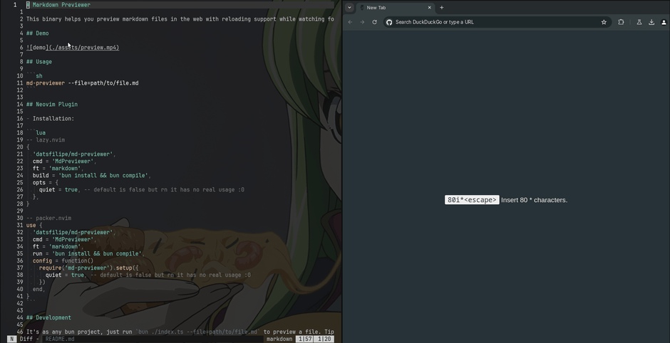

# Markdown Previewer

This binary helps you preview markdown files in the web with reloading support while watching for changes.

## Demo



## Usage

```sh
md-previewer --file=path/to/file.md
```

## Neovim Plugin

- Installation:

```lua
-- lazy.nvim
{
  'datsfilipe/md-previewer',
  cmd = 'MdPreviewer',
  ft = 'markdown',
  -- this is for downloading the binaries from the latest release
  build = ":lua dofile(vim.fn.stdpath('data') .. '/lazy/md-previewer/lua/build.lua')",
  opts = {
    quiet = true, -- default is false but rn it has no real usage :0
  },
}

-- packer.nvim
use {
  'datsfilipe/md-previewer',
  cmd = 'MdPreviewer',
  ft = 'markdown',
  -- this is for compiling the binaries with bun
  run = 'bun install && bun compile',
  config = function()
    require('md-previewer').setup({
      quiet = true, -- default is false but rn it has no real usage :0
    })
  end,
}
```

### Troubleshooting

- If you're not using `bun` to compile the binaries, you might need to set them as executables. For example, on Linux you can do `chmod +x /path/to/lazy/md-previewer/bin/*`. On other platforms you might want to search and see how it works.

## Development

It's as any bun project, just run `bun run dev --file=path/to/file.md` to preview a file. `bun compile` will generate the binaries.

- Neovim Plugin:

I'm using [direnv](https://direnv.net/) to manage some env vars for Neovim to load the plugin right away instead of the `init.lua` in your `~/.config/nvim` folder. You might want to look into it. To use direnv for this simple do `mv .envrc1 .envrc` and `direnv allow`.

- Any other enhancements are welcome :0

## License

MIT
